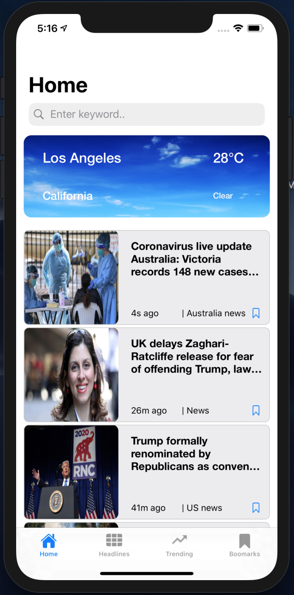
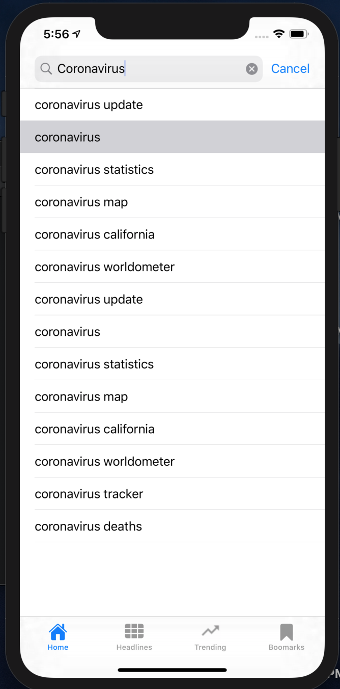
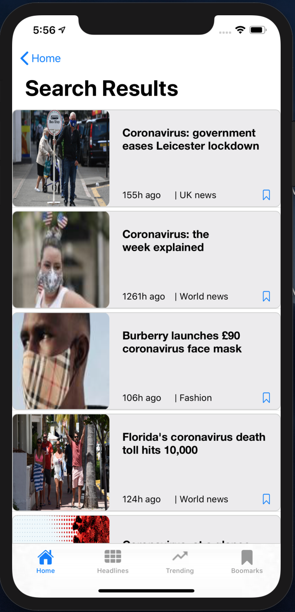

# iOS News Search App (CSCI571-Web Technologies)

Implemented an iOS mobile news app that demonstrated news of different categories and created a personalized bookmark for users to save articles and to share on their own social media. 
**Skills: React, React-Bootstrap, Node.js, Swift, Google Cloud App Engine, Xcode,JSON, CocoaPods, Model-View-Controller (MVC) design, OpenWeather API, Guardian API, Bing Autosuggest, Google Trends API**  
### Features
##### Home Tab
- Home Tab includes a search bar, a subview to show weather, and a table of news cells
- Weather subview shows weather information based on user location
- Search bar shows some autosuggestions after user enter some words and the result page shows related news articles according to the keyword

	
	
	

